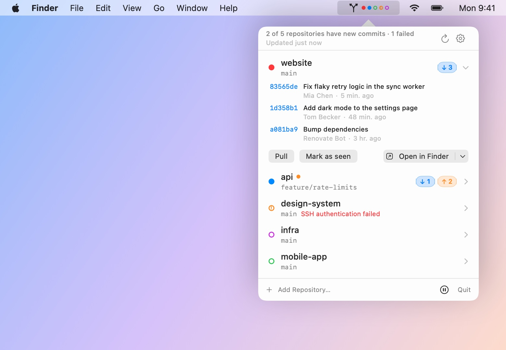
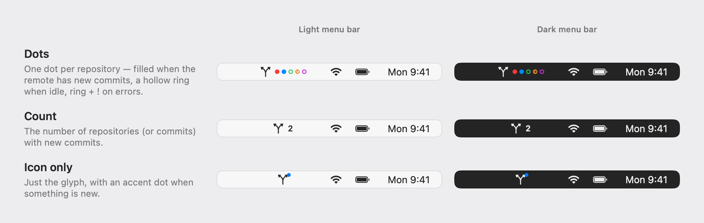
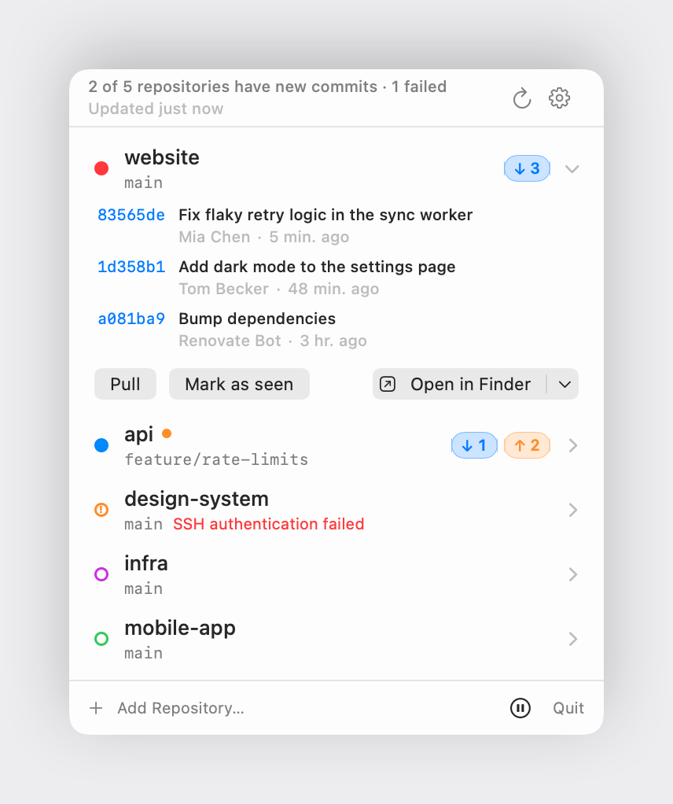
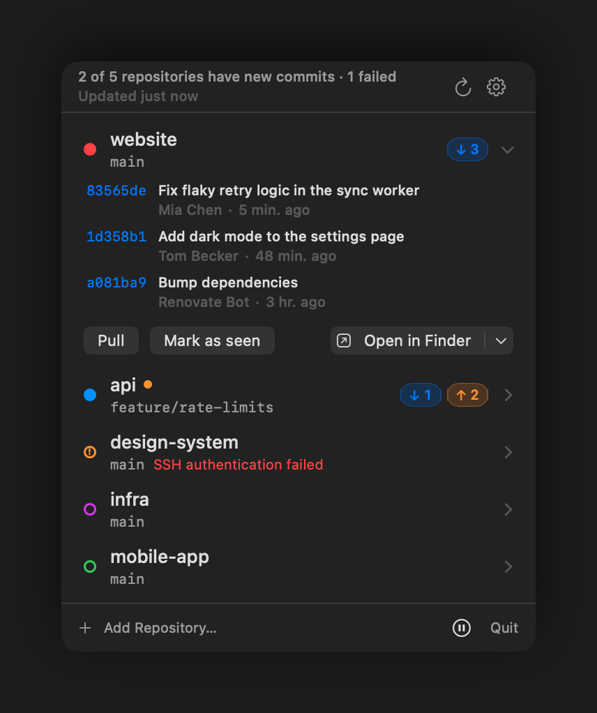
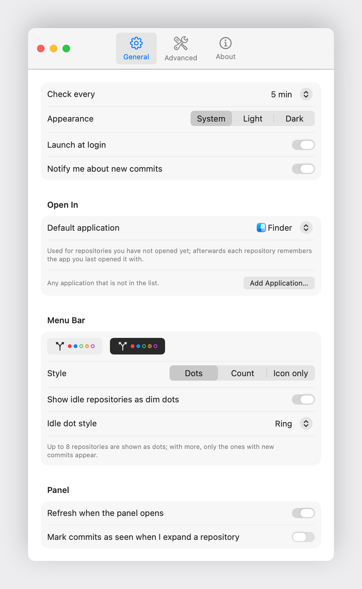
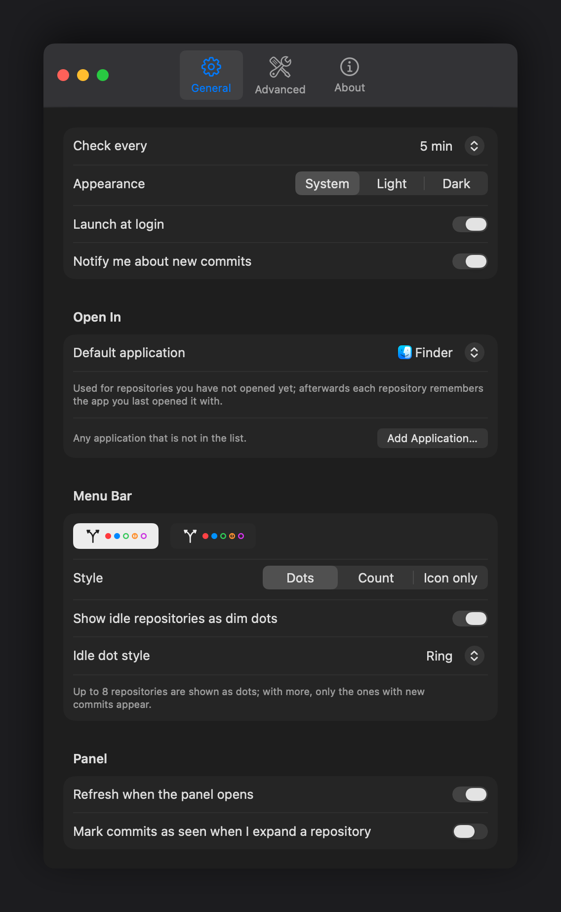

<p align="center">
  
</p>

<h1 align="center">RepoBar</h1>

<p align="center">
  Know when your repositories have new commits — from the menu bar, without clicking.
</p>

<p align="center">
  <a href="https://repobar.greatpixels.com"><b>repobar.greatpixels.com</b></a>
</p>

<p align="center">
  
  
  
  
  
</p>

<p align="center">
  <picture>
    <source media="(prefers-color-scheme: dark)" srcset="docs/screenshots/hero-dark.jpg">
    
  </picture>
</p>

RepoBar is a small macOS menu bar app for people who work across several git repositories. Add your
local clones once; RepoBar checks their remotes every few minutes and shows — right in the menu bar —
which ones have commits you haven't pulled yet. Click the icon to see the commits, open them on
GitHub/GitLab, fast-forward your branch, or jump into the repository with your editor.

## Highlights

- **Glanceable.** One colored dot per repository in the menu bar: filled when the remote is ahead of you,
  a hollow ring when you're up to date, a ring with `!` when a check failed. Prefer a number? Switch to the *Count* style.
- **Honest about your repositories.** Checks use `git ls-remote` and only `fetch` when the branch tip moved.
  RepoBar never touches your working tree, never runs `gc`, and never prompts for credentials — it uses the
  same SSH keys, agent and credential helpers your terminal does.
- **Useful when you click.** Branch, ↓ behind / ↑ ahead, uncommitted-changes dot, the list of incoming commits
  (click one to open it on the web), *Pull* (fast-forward only — no merge commits, refused if the tree is dirty),
  *Mark as seen*, *Open in* Finder / Terminal / VS Code / Cursor / Xcode / Fork / Tower….
- **Notifications** when new commits arrive, with *Open* and *Pull* actions; mute per repository.
- **Stays out of the way.** Backs off on auth failures, pauses when offline or on Low Power Mode, re-checks
  after wake, and respects `core.sshCommand`, `insteadOf` rewrites and linked worktrees.
- **Self-updating.** Daily update check via [Sparkle](https://sparkle-project.org), EdDSA-signed releases.

## The menu bar

<p align="center">
  <picture>
    <source media="(prefers-color-scheme: dark)" srcset="docs/screenshots/menubar-styles-dark.png">
    
  </picture>
</p>

Every repository gets a color (change it from the repository's context menu). With up to eight repositories
the *Dots* style shows all of them, so "3 of 5 changed" is readable at a glance; with more, only the ones with
news are shown.

## The panel

<table>
  <tr>
    <th width="50%">Light</th>
    <th width="50%">Dark</th>
  </tr>
  <tr>
    <td></td>
    <td></td>
  </tr>
</table>

- Light and dark appearance are both supported; the panel follows the system setting.
- Repositories with new commits come first. Click a row to expand it; right-click for everything else
  (*Check Now*, *Copy Path*, *Watch Branch…*, *Color*, *Mute Notifications*, *Remove*).
- Drop repository folders onto the panel to add them — or drop a folder that *contains* repositories and
  add them all at once.
- Keyboard: <kbd>⌘R</kbd> refresh, <kbd>⌘O</kbd> add, <kbd>⌘F</kbd> filter, <kbd>⌘,</kbd> settings, <kbd>⌘Q</kbd> quit.
  Right-click the menu bar icon for a quick menu.

## Settings

<table>
  <tr>
    <th width="50%">Light</th>
    <th width="50%">Dark</th>
  </tr>
  <tr>
    <td></td>
    <td></td>
  </tr>
</table>

Check interval (1–60 min), launch at login, notifications, default "open in" app, menu bar style with a live
preview, and under *Advanced*: the git binary to use, extra `PATH` entries for credential helpers, fetch
timeout, concurrency, and whether to probe with `ls-remote` before fetching.

## How a check works

1. `git status --porcelain=v2 --branch` — branch, upstream and working-tree state (read-only, no index writes).
2. Resolve the watched ref: the current branch's upstream → the remote's default branch → a per-repository override.
3. `git ls-remote --heads origin <branch>` — compare the remote tip with `refs/remotes/origin/<branch>`.
4. Only if it moved: `git fetch --porcelain --no-write-fetch-head --no-auto-maintenance --no-recurse-submodules origin`.
5. `git rev-list --left-right --count` for ahead/behind and "unseen since you last looked",
   `git log HEAD..origin/<branch>` for the commit list.

Checks run with `GIT_TERMINAL_PROMPT=0`, a non-interactive SSH configuration and hard timeouts, so a missing
key or a slow host can never hang the app. Linked worktrees that share a `.git` directory are never fetched
concurrently. Everything stays on your Mac: RepoBar has no backend, no telemetry and no accounts.

## Install

1. Download `RepoBar-<version>.zip` from the [latest release](https://github.com/aliyar/repobar/releases/latest)
   and unzip it.
2. Drag `RepoBar.app` to `/Applications` and open it. RepoBar lives in the menu bar — there is no Dock icon.

Releases are signed with a Developer ID certificate and notarized by Apple, so macOS opens them without a
warning. The release also ships an `install.txt` with these steps.

**Requirements:** macOS 14 (Sonoma) or later and a `git` binary — Homebrew's or the one from the Xcode
Command Line Tools. RepoBar finds it automatically and never triggers the "install developer tools" dialog.

## Build from source

```sh
brew install xcodegen    # once
git clone git@github.com:aliyar/repobar.git && cd repobar
make run                 # generate the Xcode project, build Debug, launch
make test                # engine tests (swift test) + app tests (xcodebuild)
make open                # open the generated project in Xcode
make logs                # follow the app's OSLog output
```

`project.yml` is the source of truth; `RepoBar.xcodeproj` is generated and git-ignored.

```
RepoBar/                 App: NSStatusItem + NSPopover shell, SwiftUI panel & settings, notifications, Sparkle
Packages/RepoBarKit/     GitEngine: process runner, git client & parsers, checker, scheduler, persistence (+ tests)
Scripts/                 release.sh, make-icon.swift, install.txt template
docs/                    Icon and README screenshots (`make screenshots` regenerates them from the real views)
```

## Releasing

```sh
make release VERSION=1.2.3 [NOTES=notes.md] [FLAGS="--draft"]
make release-dry VERSION=1.2.3      # build dist/ only, no git or GitHub
```

`Scripts/release.sh` bumps the version in `project.yml`, builds a Release app (Developer ID signed and
notarized — it falls back to ad-hoc signing when no certificate is installed), zips it with `install.txt`,
signs the archive with the Sparkle EdDSA key, writes `appcast.xml`, commits and tags `vX.Y.Z`, pushes, and publishes a
GitHub release with the zip, `install.txt` and `appcast.xml`. Running apps pick the update up from
`https://github.com/aliyar/repobar/releases/latest/download/appcast.xml`.

The EdDSA private key lives in the login keychain (created once with Sparkle's `generate_keys`; the public half
is `SUPublicEDKey` in `project.yml`). Back it up with `generate_keys -x <file>` and keep it out of the repository.

## Roadmap

- Homebrew cask
- Global keyboard shortcut to open the panel
- `~/.ssh/config` host aliases → web URLs
- Localization

## Acknowledgements

Updates are delivered by [Sparkle](https://sparkle-project.org). Everything else is SwiftUI, AppKit and `git`.

## License

[MIT](LICENSE) © 2026 Aliyar
